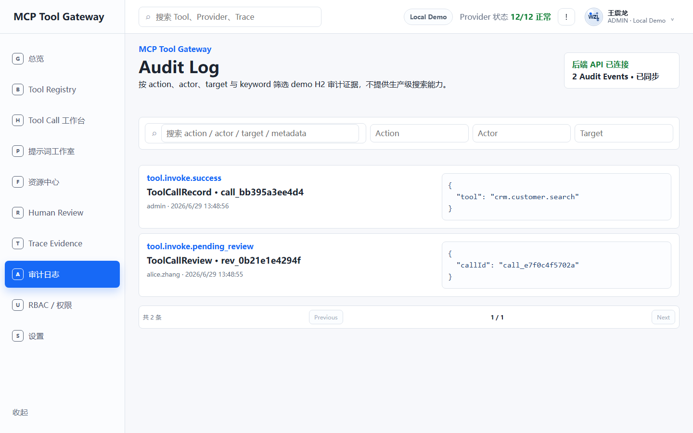
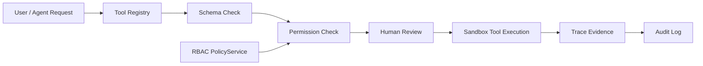

# MCP Tool Gateway / 企业 Agent 工具网关

[](https://github.com/jameswilson87156-del/mcp-tool-gateway/actions/workflows/ci.yml)

面向企业 AI Agent 的 MCP-style 工具接入网关，支持 Tool / Prompt / Resource 管理、Tool Schema、权限策略、Human Review、Trace Evidence、Audit Log、H2 持久化、RBAC Policy demo 与 MCP-style JSON-RPC adapter demo。

> 当前定位：可运行、可测试、可截图复核的 portfolio demo / learning project。项目强调 Agent 调用工具时的治理与证据链，不宣称完整 MCP 协议兼容或生产就绪。

## 项目价值

普通 Tool 调用只回答“怎么执行”；这个项目进一步展示“调用前如何约束、风险如何审批、调用后如何追踪与审计”：

`User / Agent Request -> Tool Registry -> Schema Check -> Permission Check -> Human Review -> Tool Execution -> Trace Evidence -> Audit Log`

`RBAC PolicyService` 在敏感 API 入口执行角色到动作的 demo 策略检查；高风险调用进入 Human Review，审批前不会执行 sandbox Tool。

## 真实运行截图

以下图片均由 Playwright 对本地实际 Vue 页面进行浏览器截图，来源仅为 `docs/images`。

### Tool Call Workbench


### Tool Registry


### Human Review Center


### Trace Evidence


### Prompt Studio / Resource Library


### Audit Log



## 核心能力

- **Tool Registry**：集中展示 Tool、Provider、版本、风险级别、审批要求和权限范围。
- **Tool Schema**：建模参数、必填项和 JSON Schema 摘要，为调用前检查与前端输入提供依据。
- **Tool Call Workbench**：选择 Tool、编辑 JSON 参数、发起 sandbox 调用并查看响应。
- **Human Review**：高风险调用进入待审批状态，支持 approve、reject、request changes。
- **Trace Evidence**：按 Tool Call 聚合 Request、Schema Check、Permission Check、Review、Execute、Audit Log 事件。
- **Audit Log**：记录登录、调用、审批以及 Prompt / Resource 状态变更等 demo 审计证据。
- **Prompt Studio**：支持 Prompt create、update、draft、publish、archive 和 sandbox render。
- **Resource Library**：支持上下文资源 create、update、publish、archive、预览与 Tool / Prompt 关联。
- **H2 + JdbcTemplate persistence**：用 repository 边界持久化 Tool、Prompt、Resource、Call、Review、Trace 和 Audit 数据。
- **PageResponse pagination**：为 Trace、Review、Audit、Prompt、Resource 列表提供统一分页和筛选响应。
- **RBAC PolicyService demo**：用本地角色策略表演示敏感动作授权和结构化 `403`。
- **Sandbox Tool execution**：提供可控的本地响应与 `db.query.readonly` 只读规则演示，不连接真实外部系统。
- **MCP-style JSON-RPC adapter demo**：通过 `POST /api/mcp/rpc` 演示 `tools/list`、`tools/call`、`prompts/list`、`resources/list`，并复用现有 Policy、Review、Trace 与 Audit 流程。

## 技术栈

- Java 17、Spring Boot 3、Maven
- JdbcTemplate、H2、springdoc OpenAPI / Swagger UI
- JUnit 5、Spring MockMvc
- Vue 3、Vite、TypeScript
- Nginx、Docker Compose
- GitHub Actions、Playwright screenshots

## 架构与调用链



后端 controller 负责 HTTP 与 Policy 入口，`GatewayService` 编排 Tool 调用、审批、Trace 聚合和内容工作流，JdbcTemplate repositories 负责本地 H2 读写。前端优先请求后端；后端不可用时使用明确标记的集中式 demo fallback。

## API 摘要

Base URL：`http://localhost:8080/api`

| 分组 | 主要端点 |
| --- | --- |
| Auth | `POST /auth/login`、`GET /auth/me` |
| Tools | `GET /tools`、`GET /tools/{id}`、`POST /tools/{id}/invoke` |
| Tool Calls | `GET /tool-calls`、`GET /tool-calls/{id}`、`GET /tool-calls/{id}/trace` |
| Reviews | `GET /reviews`、`POST /reviews/{id}/approve|reject|request-changes` |
| Traces | `GET /traces`、`GET /traces/{traceId}` |
| Prompts | `GET/POST /prompts`、`GET/PUT /prompts/{id}`、publish、archive、render |
| Resources | `GET/POST /resources`、`GET/PUT /resources/{id}`、publish、archive |
| Audit Logs | `GET /audit-logs` |
| RBAC demo | 敏感端点可用 `X-Demo-Role` 在本地测试 `ADMIN / DEVELOPER / REVIEWER / VIEWER` |
| MCP-style JSON-RPC demo | `POST /mcp/rpc`，支持 `tools/list`、`tools/call`、`prompts/list`、`resources/list` |

完整参数、分页结构、角色矩阵和错误响应见 [docs/API.md](docs/API.md)。

JSON-RPC demo 请求示例：

```json
{
  "jsonrpc": "2.0",
  "id": "req_001",
  "method": "tools/list",
  "params": {}
}
```

该入口只是基于 HTTP POST 的 MCP-style adapter，不支持 stdio、SSE 或完整 capabilities negotiation。详见 [docs/mcp-json-rpc-adapter.md](docs/mcp-json-rpc-adapter.md)。

## CI

GitHub Actions 在 push 或 pull request 到 `main` 时运行两项独立检查：

- Java 17：`cd backend && mvn -B test`
- Node 20：`cd frontend && npm ci && npm run build`

工作流文件：`.github/workflows/ci.yml`。

## 本地运行

后端：

```bash
cd backend
mvn test
mvn spring-boot:run
```

前端（另开终端）：

```bash
cd frontend
npm install
npm run build
npm run dev
```

浏览器打开 `http://localhost:5173`。前端默认请求 `http://localhost:8080/api`。

## Docker Compose 一键启动

```bash
docker compose up --build
```

- Frontend：`http://localhost:8088`
- Backend API：`http://localhost:8080/api`
- Swagger UI：`http://localhost:8080/swagger-ui/index.html`
- OpenAPI JSON：`http://localhost:8080/v3/api-docs`

停止容器：

```bash
docker compose down
```

Compose 默认仍使用 H2 内存 demo persistence；容器重建或重启后 demo 数据会重新初始化。它用于本地展示，不是生产部署方案。详见 [docs/deployment.md](docs/deployment.md)。

## OpenAPI / Swagger

启动 backend 后可访问：

- Swagger UI：`http://localhost:8080/swagger-ui/index.html`
- OpenAPI JSON：`http://localhost:8080/v3/api-docs`

springdoc 仅扫描当前 `/api/**` REST demo endpoints。生成的文档描述现有 MCP-style demo API，不代表完整 MCP 官方协议或生产级 API contract。

## 测试命令

```bash
cd backend
mvn test

cd ../frontend
npm ci
npm run build

cd ..
docker compose config
git diff --check
```

生成真实浏览器截图：

```bash
cd frontend
npm run screenshots
```

默认后端使用 H2 内存库并在空表时写入 demo 数据。可为手工测试配置本地文件 H2，但 `.data/`、`*.mv.db`、`*.trace.db` 不得提交。

## 测试与验收

最近一次本地验收（2026-06-29）：

- `mvn test`：passed，60 tests，0 failures，0 errors。
- `npm run build`：passed，`vue-tsc --noEmit` 与 `vite build` 完成。
- `npm run screenshots`：passed，六个页面由真实本地浏览器捕获。
- `git diff --check`：passed。
- Security check：passed，未跟踪密钥、`.env`、构建产物、日志或 H2 数据文件。

详细记录见 [docs/TEST_REPORT.md](docs/TEST_REPORT.md)。

## 项目边界

- **MCP-style，不是完整 MCP 官方协议实现**，当前只有有限的 HTTP JSON-RPC adapter demo，没有完整 MCP JSON-RPC compatibility layer。
- **JSON-RPC 入口只是 MCP-style adapter demo**，不是官方 MCP server，也不代表完整 MCP 协议兼容；当前仅支持 HTTP POST 和四个 demo methods。
- **RBAC PolicyService 是 demo，不是生产级权限系统**。
- **`X-Demo-Role` 仅用于 demo/testing helper**，请求方可伪造，不能作为生产鉴权边界。
- **Tool execution 是 demo/sandbox**，不执行真实外部系统的危险操作。
- **Prompt render 是 demo/sandbox**，不调用真实 LLM provider。
- **Resource Library 是上下文资源管理**，不是企业级知识图谱、向量库或文档同步平台。
- **H2 是本地 demo persistence**，不是生产数据库方案。
- **PageResponse 是 demo 数据分页**，当前不是数据库级生产分页、全文检索或 Elasticsearch。
- **这不是无人值守自动执行系统**；高风险动作保留显式 Human Review。
- **Docker Compose 是本地 demo 启动方式**，不包含生产级 HTTPS、WAF、身份系统、多租户或部署加固。
- `docs/design/concepts` 只保存 **AI concept references**，不是运行截图；README 图片来自真实本地浏览器页面。

集中边界说明见 [docs/project-boundary.md](docs/project-boundary.md)。生产化方向仅作为未来规划，见 [docs/roadmap.md](docs/roadmap.md)。

## Portfolio 证据

- [简历证据与可用项目描述](docs/resume-evidence.md)
- [面试问答](docs/interview-qa.md)
- [项目边界](docs/project-boundary.md)
- [后续路线图](docs/roadmap.md)
- [本地与 Docker Compose 部署说明](docs/deployment.md)
- [MCP-style JSON-RPC adapter demo](docs/mcp-json-rpc-adapter.md)
- [Prompt / Resource 工作流](docs/prompt-resource.md)
- [持久化设计](docs/persistence.md)
- [RBAC Policy demo](docs/rbac-policy-demo.md)
- [Trace Evidence](docs/trace-evidence.md)
- [Audit Log](docs/audit-log.md)
