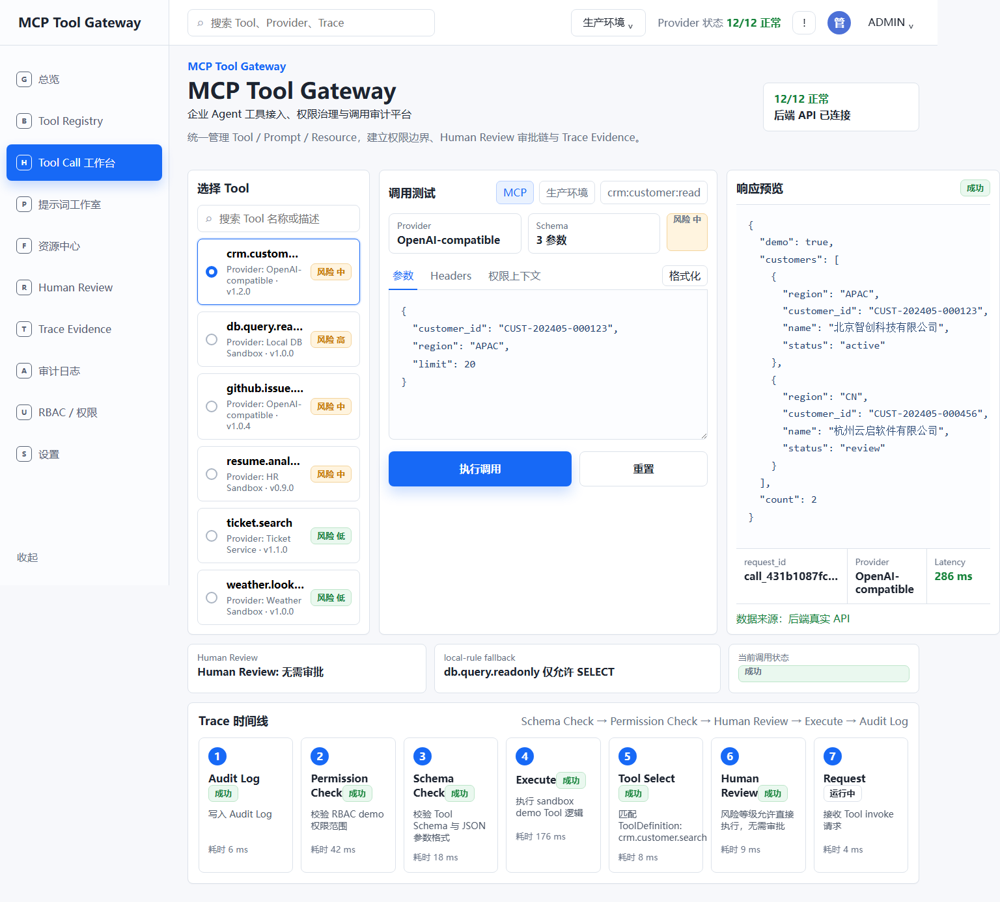
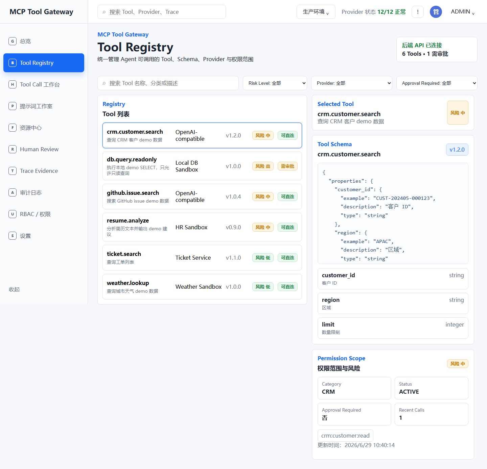
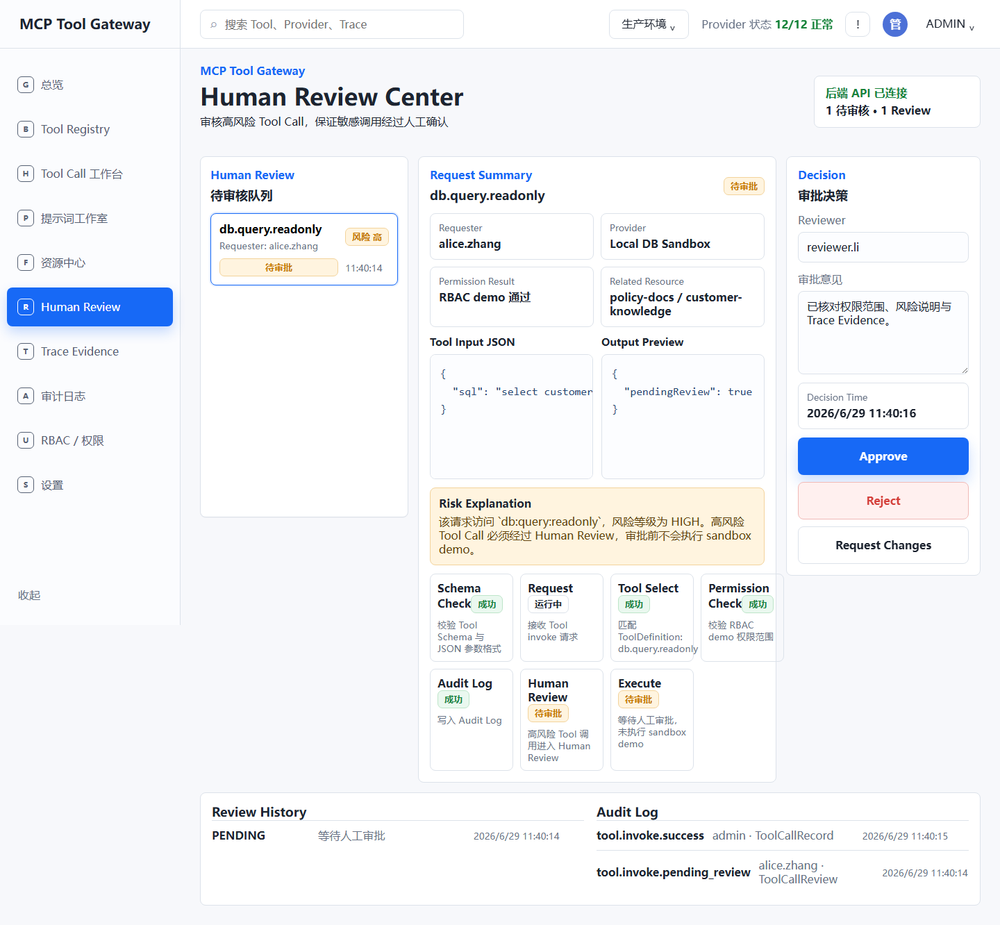
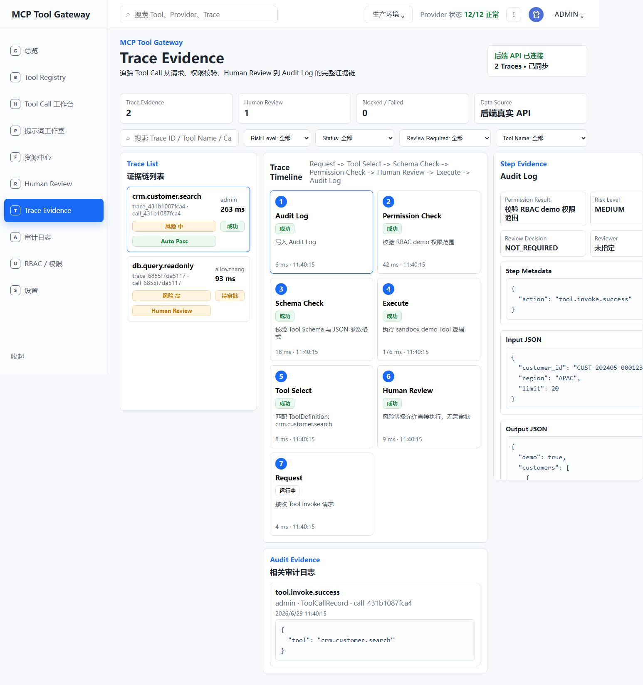
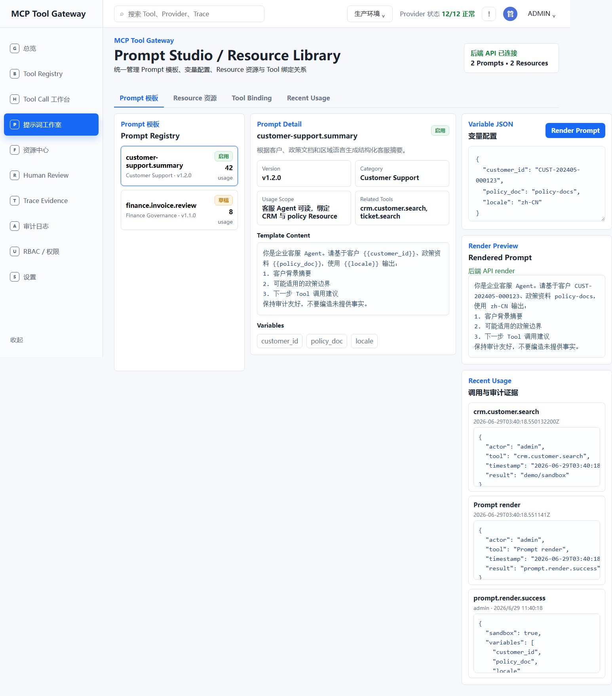

# MCP Tool Gateway

MCP Tool Gateway is an MCP-style enterprise Agent tool gateway for Tool / Prompt / Resource registration, Tool Schema governance, permission policy demos, Human Review, Tool Call Trace, and Audit Log workflows.











## Positioning

This project is aimed at enterprise AI Agent tool access and governance. The default entry is the Tool Call Workbench, because it shows the core value chain directly:

Tool selection -> JSON parameters -> sandbox invocation -> response preview -> Provider status -> Trace timeline -> Human Review state.

## Tech Stack

- Backend: Spring Boot 3, Java 17, Maven.
- Persistence: H2 + JdbcTemplate repository layer for local demo data.
- Frontend: Vue 3, Vite, TypeScript.
- Screenshots: Playwright.
- Data: H2-backed demo/sandbox data with centralized frontend fallback.

## Implemented

- Demo auth endpoints.
- Tool registry endpoints.
- Tool invocation with demo/sandbox execution.
- Risk levels: `LOW`, `MEDIUM`, `HIGH`, `BLOCKED`.
- Human Review flow for high-risk calls.
- Trace Evidence events for each invocation.
- Prompt and Resource list endpoints.
- B2-inspired Tool Call Workbench as the default frontend page.
- Tool Registry page for Tool, Schema, Provider, risk, version, approval, and permission scope inspection.
- Human Review Center page for pending high-risk Tool Call review, approve/reject/request-changes actions, Trace Evidence, and Audit Log context.
- Trace Evidence governance center with filters, Trace list, timeline drilldown, step evidence, JSON evidence, and Audit Evidence.
- Prompt Studio / Resource Library workspace for Prompt variables, demo/sandbox render, Resource previews, Tool bindings, and usage/audit evidence.
- P5A H2 + JdbcTemplate persistence for Tools, Prompts, Resources, Tool Calls, Reviews, Trace Events, Audit Logs, demo users, and role policy demo rows.

## Boundaries

- This is MCP-style only, not a complete official MCP protocol implementation.
- RBAC is a demo model, not a production-grade permission system.
- Tool execution is demo/sandbox logic only.
- `db.query.readonly` only allows local demo `SELECT` style requests and blocks dangerous SQL keywords.
- Demo data must not be treated as real enterprise data.
- Human Review is an explicit approval loop; this project does not claim unattended production execution.
- Prompt render is demo/sandbox behavior.
- Resource Library is context resource management, not an enterprise knowledge graph.
- H2 persistence is a local demo persistence layer, not a production database architecture.

## Design References

AI-generated concept images are stored in `docs/design/concepts` only as visual references. They are not real product screenshots and are not used as README runtime evidence.

The README screenshot above must be generated from the actual frontend with Playwright and saved under `docs/images`.

## Run Backend

```bash
cd backend
mvn test
mvn spring-boot:run
```

## Run Frontend

```bash
cd frontend
npm install
npm run build
npm run screenshots
```

The frontend calls `http://localhost:8080/api` first. If the backend is unavailable, it uses a clearly labeled centralized demo fallback from `frontend/src/data/demo.ts`.

By default the backend uses H2 in-memory storage and seeds demo data when the tables are empty. Local H2 file storage can be configured for development, but database files under `.data/`, `*.mv.db`, and `*.trace.db` must not be committed.

## Key API

- `POST /api/auth/login`
- `GET /api/auth/me`
- `GET /api/tools`
- `GET /api/tools/{id}`
- `POST /api/tools/{id}/invoke`
- `GET /api/tool-calls`
- `GET /api/tool-calls/{id}`
- `GET /api/tool-calls/{id}/trace`
- `GET /api/traces`
- `GET /api/traces/{traceId}`
- `GET /api/reviews`
- `POST /api/reviews/{id}/approve`
- `POST /api/reviews/{id}/reject`
- `POST /api/reviews/{id}/request-changes`
- `GET /api/prompts`
- `GET /api/prompts/{id}`
- `POST /api/prompts/{id}/render`
- `GET /api/resources`
- `GET /api/resources/{id}`
- `GET /api/dashboard/stats`
- `GET /api/audit-logs`
